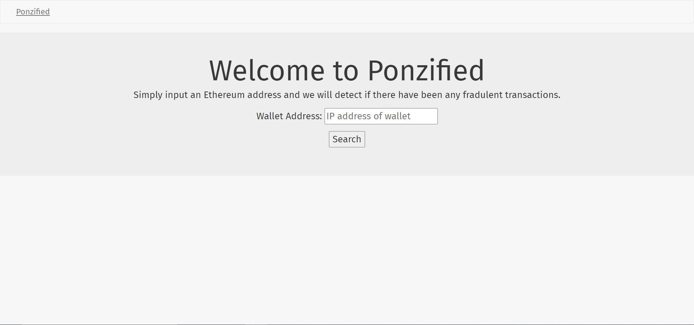

<div id="top"></div>
<!--
*** Thanks for checking out the Best-README-Template. If you have a suggestion
*** that would make this better, please fork the repo and create a pull request
*** or simply open an issue with the tag "enhancement".
*** Don't forget to give the project a star!
*** Thanks again! Now go create something AMAZING! :D
-->


<!-- PROJECT SHIELDS -->
<!--
*** I'm using markdown "reference style" links for readability.
*** Reference links are enclosed in brackets [ ] instead of parentheses ( ).
*** See the bottom of this document for the declaration of the reference variables
*** for contributors-url, forks-url, etc. This is an optional, concise syntax you may use.
*** https://www.markdownguide.org/basic-syntax/#reference-style-links
-->

[![Contributors][contributors-shield]][contributors-url]
[![Forks][forks-shield]][forks-url]
[![Stargazers][stars-shield]][stars-url]
[![Issues][issues-shield]][issues-url]
[![MIT License][license-shield]][license-url]


<!-- PROJECT LOGO -->
<br />
<div align="center">
  <a href="https://github.com/ky99123/Ponzified">
    
  </a>

<h3 align="center">Ponzified</h3>

  <p align="center">
    A Machile Learning & Data Visualisation solution to Ethereum Fraud 
    <br />
    <a href="https://github.com/ky99123/Ponzified"><strong>Explore the docs »</strong></a>
    <br />
    <br />
    <a href="https://github.com/ky99123/Ponzified">View Demo</a>
    ·
    <a href="https://github.com/ky99123/Ponzified/issues">Report Bug</a>
    ·
    <a href="https://github.com/ky99123/Ponzified/issues">Request Feature</a>
  </p>
</div>


<!-- TABLE OF CONTENTS -->
<details>
  <summary>Table of Contents</summary>
  <ol>
    <li>
      <a href="#about-the-project">About The Project</a>
      <ul>
        <li><a href="#built-with">Built With</a></li>
      </ul>
    </li>
    <li>
      <a href="#getting-started">Getting Started</a>
      <ul>
        <li><a href="#installation">Installation</a></li>
      </ul>
    </li>
    <li><a href="#usage">Usage</a></li>
    <li><a href="#roadmap">Roadmap</a></li>
    <li><a href="#contributing">Contributing</a></li>
    <li><a href="#license">License</a></li>
    <li><a href="#contact">Contact</a></li>
    <li><a href="#acknowledgments">Acknowledgments</a></li>
  </ol>
</details>


<!-- ABOUT THE PROJECT -->
## About The Project

[![Product Name Screen Shot][product-screenshot]](https://github.com/ky99123/Ponzified)

With the respective benefits cryptocurrency brought to users, it has also introduced various illegal activities over the years. In this work, we focused on the Ethereum network and developed the machine learning Ethereum fraudulent activities identification tool to address the challenge faced by investigators to identify fraudulent transactions/wallet addresses.
<p align="right">(<a href="#top">back to top</a>)</p>


### Built With

* [Flask](https://flask.palletsprojects.com/en/2.1.x/)
* [Scikit-Learn](https://scikit-learn.org/)
* [Dash](https://dash.plotly.com/)

<p align="right">(<a href="#top">back to top</a>)</p>


<!-- GETTING STARTED -->
## Getting Started

To get a local copy up and running follow these simple example steps.

### Installation

1. Clone the repo
   ```sh
   git clone https://github.com/ky99123/Ponzified.git
   ```
2. Install dependancies
   ```sh
   pip install -r requirements.txt
   ```
3. Run Main.py
   ```sh
   python3 main.py
   ``` 
4. In your browser, navigate to
   ```sh
   127.0.0.1:8080
   ```

<p align="right">(<a href="#top">back to top</a>)</p>


<!-- USAGE EXAMPLES -->
## Usage

On the Main landing page, enter the wallet address you would like to investigate.



In the results page you will see a table. The table can be ordered by clicking on the headers. There are also Bar Charts under the table for visualisation purposes.


Between the table and the charts is a button which will lead you to the Netwrok Graph exploration platform.


There, you can will see the addresses that are associated with your original queried address. The arrows denote the direction of Ethereum transfers. the numbers are a count of instances such transactions happened. You can easily find addresses that have frequent transactions with the queried transactions and hence are able to pivot to that address.


If you decide to investigate another address, feel free to key in or paste another wallet address in the search bar. Bear in mind the chart will not update until a valid address is provided, so if it is not changing, you might want to check your input again!


Finally, you can click the icon on the left to return to the landing page.

<p align="right">(<a href="#top">back to top</a>)</p>


<!-- ROADMAP -->
## Roadmap

- [x] Data Retrieval
- [x] Machine Learning predictions
- [x] Data Visualisation
    - [x] Timeline of transactions
    - [x] Table of data
    - [x] Bar charts for Sent and Received transactions
    - [x] Network Graph of wallet addresses

See the [open issues](https://github.com/github_username/repo_name/issues) for a full list of proposed features (and known issues).

<p align="right">(<a href="#top">back to top</a>)</p>


<!-- CONTRIBUTING -->
## Contributing

Contributions are what make the open source community such an amazing place to learn, inspire, and create. Any contributions you make are **greatly appreciated**.

If you have a suggestion that would make this better, please fork the repo and create a pull request. You can also simply open an issue with the tag "enhancement".
Don't forget to give the project a star! Thanks again!

1. Fork the Project
2. Create your Feature Branch (`git checkout -b feature/AmazingFeature`)
3. Commit your Changes (`git commit -m 'Add some AmazingFeature'`)
4. Push to the Branch (`git push origin feature/AmazingFeature`)
5. Open a Pull Request

<p align="right">(<a href="#top">back to top</a>)</p>


<!-- LICENSE -->
## License

Distributed under the MIT License. See `LICENSE.txt` for more information.

<p align="right">(<a href="#top">back to top</a>)</p>


<!-- CONTACT -->
## Contact

Project Link: [https://github.com/ky99123/Ponzified](https://github.com/ky99123/Ponzified)

<p align="right">(<a href="#top">back to top</a>)</p>


<!-- ACKNOWLEDGMENTS -->
## Acknowledgments

[Dr Goh Weihan](https://sg.linkedin.com/in/weihan-goh) - For his valuable guidance and patience

[Vagif Alivev](https://www.kaggle.com/vagifa) - For the invaluable dataset that formed the basis of this project

<p align="right">(<a href="#top">back to top</a>)</p>


<!-- MARKDOWN LINKS & IMAGES -->
<!-- https://www.markdownguide.org/basic-syntax/#reference-style-links -->
[contributors-shield]: https://img.shields.io/github/contributors/ky99123/Ponzified.svg?style=for-the-badge
[contributors-url]: https://github.com/ky99123/Ponzified/graphs/contributors
[forks-shield]: https://img.shields.io/github/forks/ky99123/Ponzified.svg?style=for-the-badge
[forks-url]: https://github.com/ky99123/Ponzified/network/members
[stars-shield]: https://img.shields.io/github/stars/ky99123/Ponzified.svg?style=for-the-badge
[stars-url]: https://github.com/ky99123/Ponzified/stargazers
[issues-shield]: https://img.shields.io/github/issues/ky99123/Ponzified.svg?style=for-the-badge
[issues-url]: https://github.com/ky99123/Ponzified/issues
[license-shield]: https://img.shields.io/github/license/ky99123/Ponzified.svg?style=for-the-badge
[license-url]: https://github.com/ky99123/Ponzified/blob/master/LICENSE.txt
[product-screenshot]: images/landing.png
